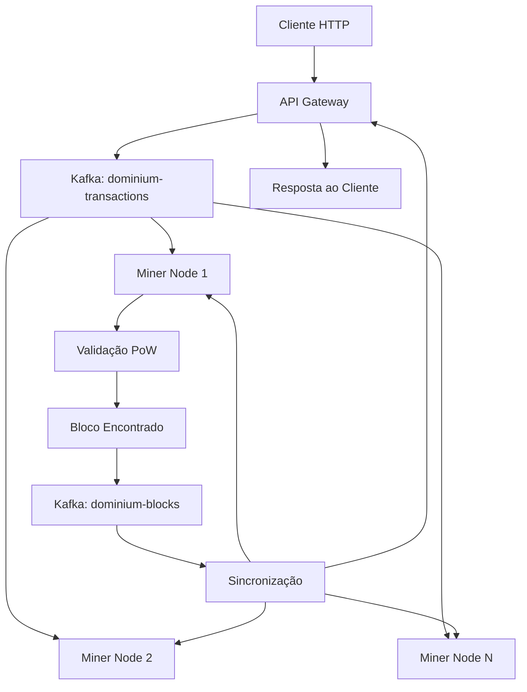

# Arquitetura do Sistema Dominium - Blue Print

Este documento detalha a arquitetura completa da blockchain Dominium, incluindo estruturas de dados técnicas e topografia da rede distribuída. Serve como referência técnica para desenvolvimento, manutenção e auditoria do sistema.

## 1. Estrutura do Bloco (Block)

O bloco é a unidade fundamental da blockchain, dividido em duas partes principais: **Header** (metadados para consenso) e **Body** (conteúdo transacional).

### Header (Cabeçalho)

Contém as informações essenciais para validação da Prova de Trabalho (PoW) e encadeamento imutável da cadeia.

| Campo            | Tipo     | Descrição                                                           |
| ---------------- | -------- | ------------------------------------------------------------------- |
| `HashOfPrevious` | `[]byte` | Hash SHA-256 do bloco anterior. Garante imutabilidade da cadeia.    |
| `MerkleRootHash` | `[]byte` | Hash raiz Merkle de todas as transações do bloco.                   |
| `Timestamp`      | `int64`  | Momento de criação do bloco (Unix nanoseconds).                     |
| `Difficulty`     | `int32`  | Alvo de dificuldade (ex: número de zeros iniciais no hash).         |
| `Nonce`          | `uint64` | Número variável alterado pelo minerador para encontrar hash válido. |
| `Hash`           | `[]byte` | Identificador único do bloco (SHA-256 do Header serializado).       |

### Body (Corpo)

Contém os dados processados e validados que compõem o bloco.

| Campo                | Tipo            | Descrição                                           |
| -------------------- | --------------- | --------------------------------------------------- |
| `TransactionCounter` | `int`           | Número total de transações incluídas no bloco.      |
| `Transactions`       | `[]Transaction` | Lista de objetos Transaction validados e incluídos. |

## 2. Estrutura da Transação (Transaction)

A transação é a unidade básica de troca de valor e ativos digitais na rede Dominium.

| Campo       | Tipo              | Descrição                                                           |
| ----------- | ----------------- | ------------------------------------------------------------------- |
| `ID`        | `string`          | Hash SHA-256 único da transação (calculado do payload serializado). |
| `Timestamp` | `int64`           | Data/hora da criação (Unix nanoseconds).                            |
| `Type`      | `TransactionType` | Tipo da transação (0: Transfer, 1: Mint, 2: Genesis).               |
| `PublKey`   | `string`          | Chave pública do remetente (hex-encoded ECDSA).                     |
| `Recipient` | `string`          | Chave pública do destinatário (hex-encoded ECDSA).                  |
| `NFTID`     | `string`          | Identificador único do ativo digital sendo transacionado.           |
| `Sig`       | `[]byte`          | Assinatura digital ECDSA provando posse da chave privada.           |

### Tipos de Transação

- **Transfer (0)**: Transferência de NFT entre contas existentes
- **Mint (1)**: Criação de novo NFT (apenas autoridade admin)
- **Genesis (2)**: Transação especial do bloco gênesis

## 3. Topografia da Rede Distribuída

A rede Dominium opera em um **modelo Hub-and-Spoke Híbrido descentralizado**, utilizando Apache Kafka como barramento de eventos centralizado.

### Componentes da Topografia

#### O Barramento (Kafka Cluster)

- **Função**: Camada de transporte e comunicação P2P
- **Tópicos**:
    - `dominium-transactions`: Transações pendentes injetadas pelas APIs
    - `dominium-blocks`: Blocos confirmados propagados pelos mineradores

#### API Gateways (Edge Nodes)

- **Localização**: Borda da rede (edge)
- **Funções**:
    - Receber tráfego externo via HTTP REST API
    - Validar e injetar transações assinadas no Kafka
    - Observar tópicos para fornecer status em tempo real
    - **Não mineram** - apenas observadores e injetores
- **Endpoints principais**:
    - `POST /transactions` - Submissão de transações
    - `GET /network/status` - Estado da rede e blockchain

#### ⚡ Miner Nodes (Core Nodes)

- **Localização**: Centro do processamento (core)
- **Funções**:
    - Escutar tópicos Kafka para novas transações
    - Manter e validar Mempool local
    - Executar algoritmo Proof-of-Work
    - Propagar blocos encontrados de volta ao Kafka
    - Sincronizar estado com outros nodes via reorganização
- **Características**:
    - Mantêm cópia completa da blockchain
    - Implementam consenso Nakamoto
    - Resolvem forks via longest-chain rule

### Fluxo de Dados na Topografia

### Modelo Hub-and-Spoke Híbrido

- **Hub**: Kafka Cluster (centralizado para eficiência)
- **Spokes**: Nodes distribuídos (descentralizados)
- **Vantagens**:
    - Eficiência de publish massivo via Kafka
    - Descentralização de consenso e mineração
    - Escalabilidade horizontal dos nodes
    - Tolerância a falhas dos componentes individuais

## Validação em Camadas

A arquitetura Dominium implementa um sistema de validação em duas camadas para otimizar performance e segurança:

### Pré-validação (API Gateway)

- **Responsável**: API Gateway (Edge Nodes)
- **Propósito**: Validação rápida e superficial para rejeitar transações obviamente inválidas
- **Escopo**:
    - Verificação de formato e campos obrigatórios
    - Validação básica de assinaturas ECDSA
    - Verificação de sintaxe da transação
- **Características**:
    - Stateless (não mantém estado da blockchain)
    - Rápida (baixa latência)
    - Opcional (transações podem passar mesmo com pré-validação falha)

### Validação Definitiva (Miner Nodes)

- **Responsável**: Miner Nodes (Core Nodes)
- **Propósito**: Validação completa e autoritativa de todas as regras de consenso
- **Escopo**:
    - Validação completa de assinaturas e propriedade
    - Verificação de regras de consenso (unicidade NFT, autoridade admin)
    - Execução de transações no estado da blockchain
    - Validação de Proof-of-Work
- **Características**:
    - Statefull (mantém cópia completa da blockchain)
    - Autorizada (única fonte de verdade para consenso)
    - Obrigatória (transações inválidas são rejeitadas)

### Justificativa da Duplicação na Contagem de Transações

O campo `TransactionCounter` no Header e o array `Transactions` no Body servem propósitos distintos:

- **TransactionCounter (Header)**: Usado na serialização para cálculo do hash do bloco. Garante imutabilidade criptográfica e eficiência na validação de PoW.
- **Transactions (Body)**: Contém os dados completos das transações para processamento e consenso.

**Decisão**: Manter ambos campos pois o `TransactionCounter` otimiza a validação de hash sem necessidade de desserializar todo o array de transações.

## Sincronização e Idempotência

### Idempotência no Processamento de Blocos

O sistema garante que blocos recebidos múltiplas vezes sejam processados apenas uma vez:

- **Mecanismo**: Verificação de hash duplicado antes da inserção na blockchain
- **Comportamento**: Blocos já conhecidos são ignorados silenciosamente
- **Benefício**: Tolerância a retransmissões acidentais do Kafka e mensagens duplicadas
- **Implementação**: `internal/node/server.go` - método `processBlock()`

### Processo de Bootstrapping

Nodes novos sincronizam com a rede através do mesmo mecanismo de processamento de blocos:

1. Conexão ao tópico `dominium-blocks` do Kafka
2. Processamento sequencial de todos os blocos históricos
3. Reconstrução do estado da blockchain local
4. Ativação da mineração após sincronização completa

## Regras de Consenso Implementadas

### Autoridade Admin

- Apenas transações de Mint podem ser executadas pela chave pública admin
- Outros tipos de transação rejeitados se não autorizados

### Unicidade de NFTs

- Cada NFTID pode ser mintado apenas uma vez
- Tentativas de mint duplicado são rejeitadas

### Validação de Propriedade

- Transferências só podem ser iniciadas pelo proprietário atual do NFT
- Estado de contas mantido e validado em cada bloco

### Resolução de Forks

- Longest-chain rule: Cadeia com maior trabalho acumulado prevalece
- Reorganização automática quando fork detectado
- Transações dos blocos desconectados retornam à mempool

## Métricas Técnicas

- **Algoritmo de Consenso**: Nakamoto (PoW + Longest Chain)
- **Criptografia**: ECDSA P-256 para assinaturas
- **Hashing**: SHA-256 duplo para blocos e transações
- **Estrutura de Dados**: Merkle Tree para transações
- **Transporte P2P**: Apache Kafka como event bus
- **API**: REST HTTP para integração externa

---

_Este documento é a referência técnica oficial da arquitetura Dominium. Todas as implementações devem seguir estas especificações para manter compatibilidade e segurança da rede._
