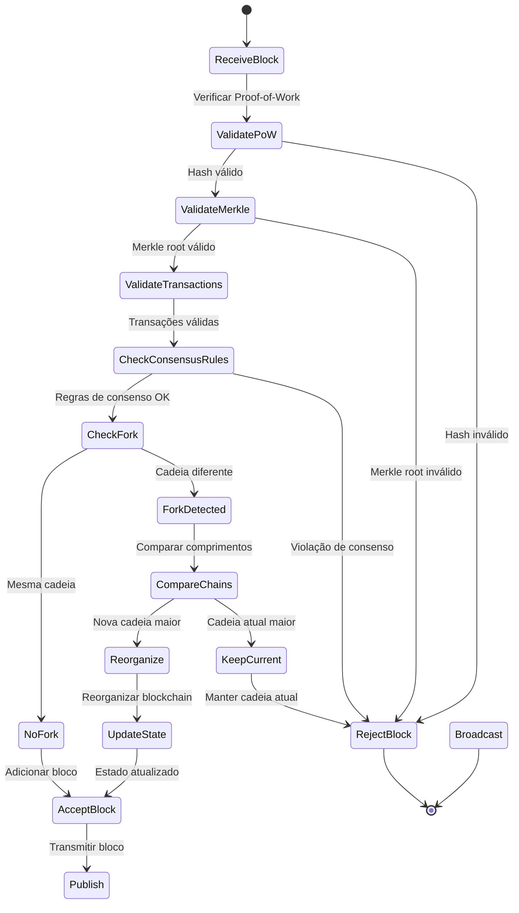

# Diagrama de Atividades - Validação de Bloco e Consenso

```mermaid
stateDiagram-v2
    [*] --> ReceiveBlock
    ReceiveBlock --> ValidatePoW: Verificar Proof-of-Work
    ValidatePoW --> ValidateMerkle: Hash válido
    ValidatePoW --> RejectBlock: Hash inválido
    ValidateMerkle --> ValidateTransactions: Merkle root válido
    ValidateMerkle --> RejectBlock: Merkle root inválido
    ValidateTransactions --> CheckConsensusRules: Transações válidas
    CheckConsensusRules --> CheckFork: Regras de consenso OK
    CheckConsensusRules --> RejectBlock: Violação de consenso
    CheckFork --> NoFork: Mesma cadeia
    CheckFork --> ForkDetected: Cadeia diferente
    ForkDetected --> CompareChains: Comparar comprimentos
    CompareChains --> Reorganize: Nova cadeia maior
    CompareChains --> KeepCurrent: Cadeia atual maior
    Reorganize --> UpdateState: Reorganizar blockchain
    UpdateState --> AcceptBlock: Estado atualizado
    KeepCurrent --> RejectBlock: Manter cadeia atual
    NoFork --> AcceptBlock: Adicionar bloco
    AcceptBlock --> Publish: Transmitir bloco
    Broadcast --> [*]
    RejectBlock --> [*]
```
