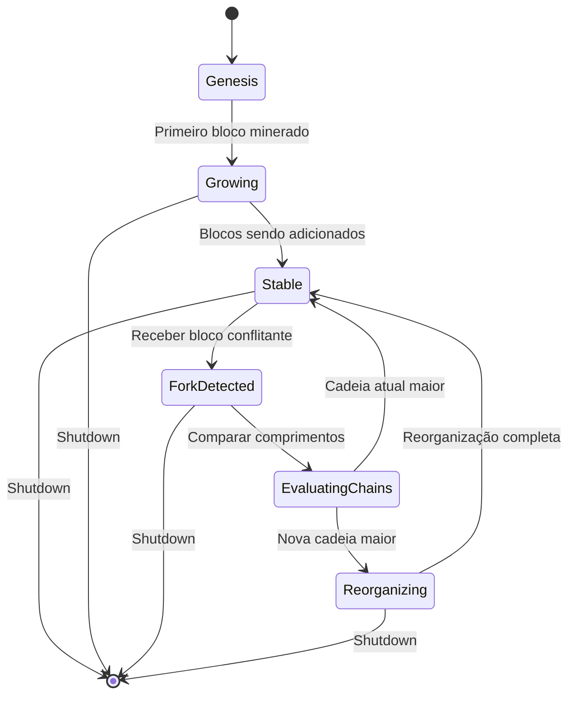

# Diagrama de Estados - Estado da Blockchain

```mermaid
stateDiagram-v2
    [*] --> Genesis
    Genesis --> Growing: Primeiro bloco minerado
    Growing --> Stable: Blocos sendo adicionados
    Stable --> ForkDetected: Receber bloco conflitante
    ForkDetected --> EvaluatingChains: Comparar comprimentos
    EvaluatingChains --> Reorganizing: Nova cadeia maior
    EvaluatingChains --> Stable: Cadeia atual maior
    Reorganizing --> Stable: Reorganização completa
    Stable --> [*]: Shutdown
    Growing --> [*]: Shutdown
    ForkDetected --> [*]: Shutdown
    Reorganizing --> [*]: Shutdown
```
