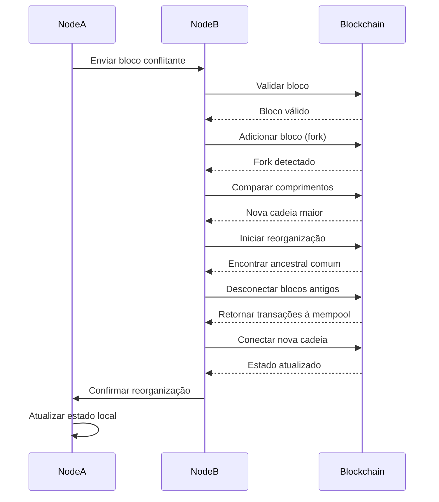

# Diagrama de Sequência - Resolução de Forks

```mermaid
sequenceDiagram
    participant NodeA
    participant NodeB
    participant Blockchain

    NodeA->>NodeB: Enviar bloco conflitante
    NodeB->>Blockchain: Validar bloco
    Blockchain-->>NodeB: Bloco válido
    NodeB->>Blockchain: Adicionar bloco (fork)
    Blockchain-->>NodeB: Fork detectado
    NodeB->>Blockchain: Comparar comprimentos
    Blockchain-->>NodeB: Nova cadeia maior
    NodeB->>Blockchain: Iniciar reorganização
    Blockchain-->>NodeB: Encontrar ancestral comum
    NodeB->>Blockchain: Desconectar blocos antigos
    Blockchain-->>NodeB: Retornar transações à mempool
    NodeB->>Blockchain: Conectar nova cadeia
    Blockchain-->>NodeB: Estado atualizado
    NodeB->>NodeA: Confirmar reorganização
    NodeA->>NodeA: Atualizar estado local
```
