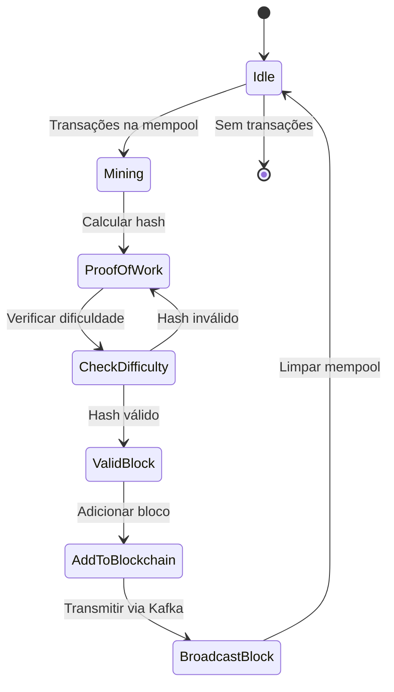

# Diagrama de Atividades - Processo de Mineração

```mermaid
stateDiagram-v2
    [*] --> Idle
    Idle --> Mining: Transações na mempool
    Mining --> ProofOfWork: Calcular hash
    ProofOfWork --> CheckDifficulty: Verificar dificuldade
    CheckDifficulty --> ValidBlock: Hash válido
    CheckDifficulty --> ProofOfWork: Hash inválido
    ValidBlock --> AddToBlockchain: Adicionar bloco
    AddToBlockchain --> BroadcastBlock: Transmitir via Kafka
    BroadcastBlock --> Idle: Limpar mempool
    Idle --> [*]: Sem transações
```
