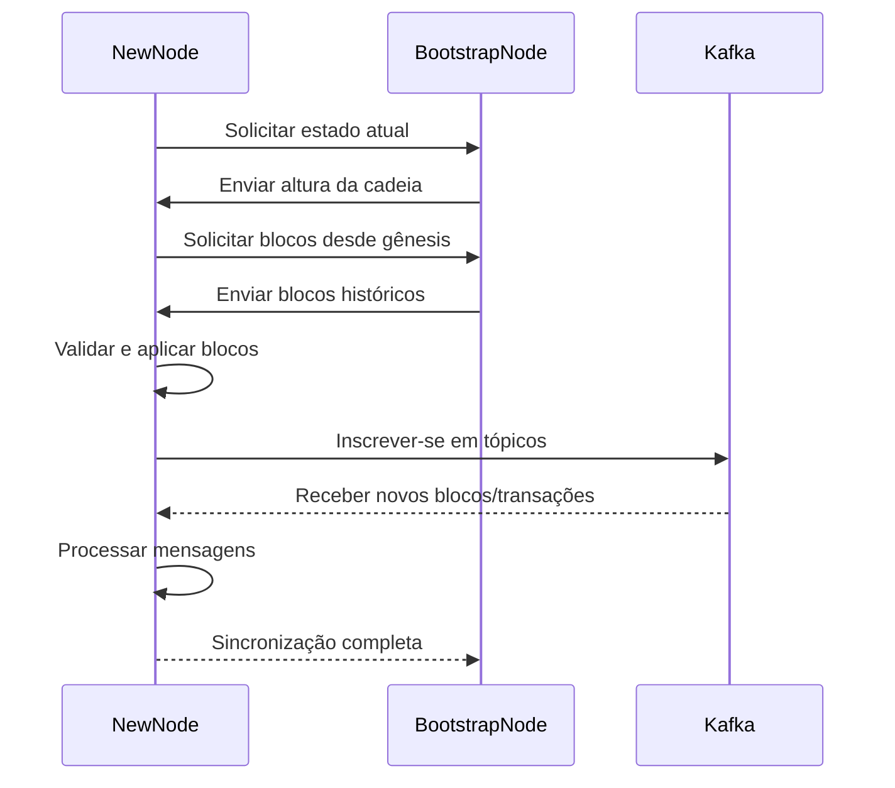

# Diagrama de Sequência - Sincronização de Nós

```mermaid
sequenceDiagram
    participant NewNode
    participant BootstrapNode
    participant Kafka

    NewNode->>BootstrapNode: Solicitar estado atual
    BootstrapNode->>NewNode: Enviar altura da cadeia
    NewNode->>BootstrapNode: Solicitar blocos desde gênesis
    BootstrapNode->>NewNode: Enviar blocos históricos
    NewNode->>NewNode: Validar e aplicar blocos
    NewNode->>Kafka: Inscrever-se em tópicos
    Kafka-->>NewNode: Receber novos blocos/transações
    NewNode->>NewNode: Processar mensagens
    NewNode-->>BootstrapNode: Sincronização completa
```
