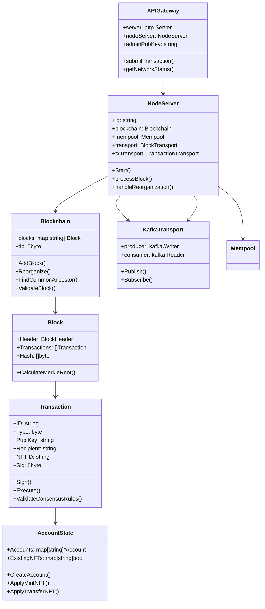

# Diagrama de Classes - Estrutura Principal do Sistema

```mermaid
classDiagram
    class NodeServer {
        +id: string
        +blockchain: Blockchain
        +mempool: Mempool
        +transport: BlockTransport
        +txTransport: TransactionTransport
        +Start()
        +processBlock()
        +handleReorganization()
    }

    class APIGateway {
        +server: http.Server
        +nodeServer: NodeServer
        +adminPubKey: string
        +submitTransaction()
        +getNetworkStatus()
    }

    class Blockchain {
        +blocks: map[string]*Block
        +tip: []byte
        +AddBlock()
        +Reorganize()
        +FindCommonAncestor()
        +ValidateBlock()
    }

    class Block {
        +Header: BlockHeader
        +Transactions: []Transaction
        +Hash: []byte
        +CalculateMerkleRoot()
    }

    class Transaction {
        +ID: string
        +Type: byte
        +PublKey: string
        +Recipient: string
        +NFTID: string
        +Sig: []byte
        +Sign()
        +Execute()
        +ValidateConsensusRules()
    }

    class AccountState {
        +Accounts: map[string]*Account
        +ExistingNFTs: map[string]bool
        +CreateAccount()
        +ApplyMintNFT()
        +ApplyTransferNFT()
    }

    class KafkaTransport {
        +producer: kafka.Writer
        +consumer: kafka.Reader
        +Publish()
        +Subscribe()
    }

    NodeServer --> Blockchain
    NodeServer --> Mempool
    NodeServer --> KafkaTransport
    APIGateway --> NodeServer
    Blockchain --> Block
    Block --> Transaction
    Transaction --> AccountState
    NodeServer --> KafkaTransport
```
