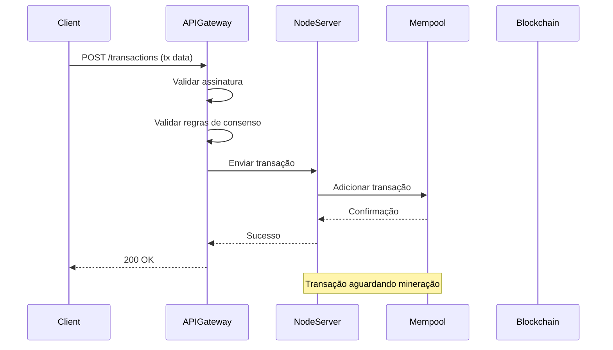

# Diagrama de Sequência - Submissão de Transação

```mermaid
sequenceDiagram
    participant Client
    participant APIGateway
    participant NodeServer
    participant Mempool
    participant Blockchain

    Client->>APIGateway: POST /transactions (tx data)
    APIGateway->>APIGateway: Validar assinatura
    APIGateway->>APIGateway: Validar regras de consenso
    APIGateway->>NodeServer: Enviar transação
    NodeServer->>Mempool: Adicionar transação
    Mempool-->>NodeServer: Confirmação
    NodeServer-->>APIGateway: Sucesso
    APIGateway-->>Client: 200 OK

    Note over NodeServer,Mempool: Transação aguardando mineração
```
